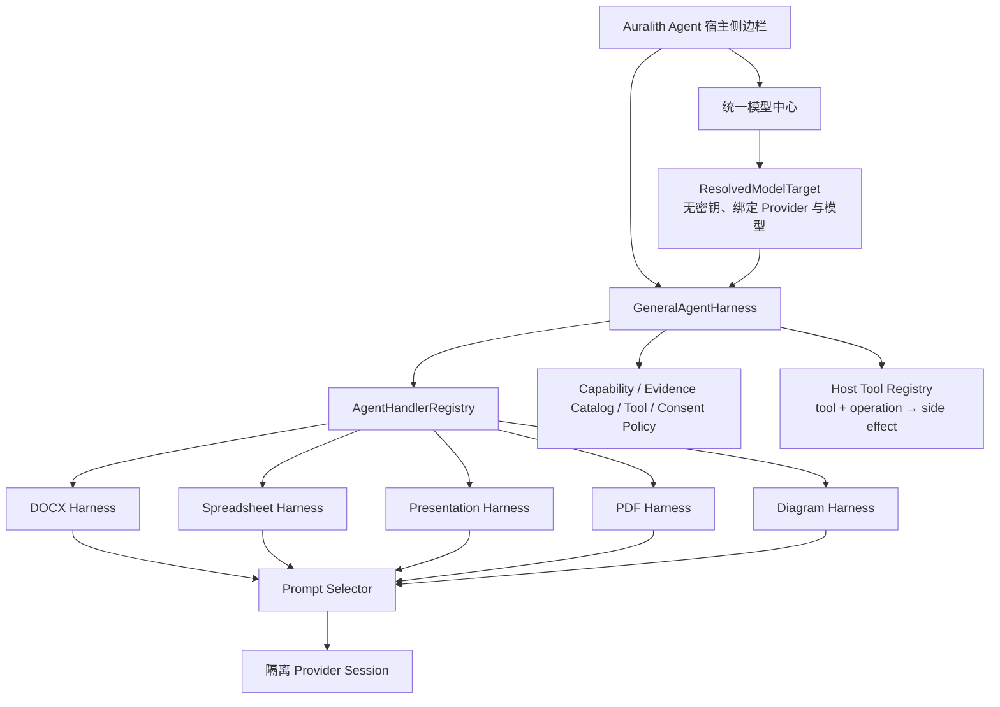

# Auralith Agent Harness 架构

## 目标

Auralith Agent 采用“一个通用运行时 + 多个文件格式专用 Harness”的结构。通用层不理解 DOCX、单元格或幻灯片的业务细节，只负责所有格式都必须一致的安全和执行规则；专用层负责对象读取、检索策略、格式语义和 Prompt。

## General Agent Harness

代码入口：`desktop-sdk/ChromiumBasedEditors/plugins/ai-agent/src/agent-harness/index.ts`

通用层负责：

- `document / spreadsheet / presentation / pdf / diagram / unknown` 编辑器上下文。
- 当前未保存文档版本的 `documentId + revisionId` 绑定。
- 不包含 API Key、Header 或 endpoint 凭证的 `ResolvedModelTarget`。
- Session 与 Task 状态机、取消、关闭、进度和确定性事件。
- 模型能力与验证等级检查；“用户声明”不能等同“已探测”。
- Evidence 数量、模态、来源和当前版本校验；Handler 只能引用 Host 为当前快照签发的不可变 `evidenceCatalog`。
- Tool 默认拒绝、显式 allow-list 和用户审批；副作用由 Host Tool Registry 通过 `toolId + operation` 判定，Handler 不能自报降级。
- Tool 输入在审批前深复制并冻结；view/read-only Session 强制拒绝 write/execute。
- Handler 优先级路由、冲突检测和无适配器时 fail-closed。

Prompt、文件内容和模型输出都不能扩大 Tool 权限。只有 Host 创建的 `ToolPolicy` 和用户审批能授权副作用。

## 专用 Harness 与 Prompt 系统

格式和任务 Prompt 位于：

- `src/agent-harness/format-profiles.ts`
- `src/agent-harness/prompt-selector.ts`

Prompt 栈顺序固定：

1. `auralith.general.core`
2. 文件格式 Prompt
3. 任务意图 Prompt
4. 模型能力 Prompt
5. 专用 Handler 的输出契约

选择依据只能来自宿主可信元数据：精确文件扩展名、MIME、已解析的文件格式、编辑器家族和任务意图。正文、图片 OCR、批注、公式结果及检索段不能参与 Prompt 选择。Word-processing 编辑器家族本身不等于 DOCX；RTF、ODT、TXT 等不会仅因位于文字编辑器中而误选 DOCX Prompt。

当前包含六种格式：

| Profile | 主要语义 |
| --- | --- |
| DOCX | 语义阅读顺序、章节、表格、页眉页脚、批注修订、锚定对象与页面关系 |
| Spreadsheet | Workbook、Sheet、Range、公式与显示值、透视表、筛选、图表 |
| Presentation | Slide、Notes、Master、对象层级、组合与页面构图 |
| PDF | 页面、原生文字、OCR、Annotation、表单、几何与重建不确定性 |
| Diagram | Node、Edge、Group、Container、方向、几何和图例 |
| Generic | 只使用显式结构，不虚构格式专属对象 |

当前包含 `read / summarize / answer / visualize / cowork / audit` 六种任务意图。`visualize` 与 `cowork` Prompt 只允许提出规格或变更方案，不代表已经获得渲染或写入权限。

## DOCX 专用能力当前接入

DOCX 是首个真实适配器：

- SDKJS 只读快照提供结构、页面、资产和来源导航。
- Reader 在完整快照前先运行轻量 preflight，统计页数、字符和视觉对象。
- 生产调用链固定为 `ReaderApp → GeneralAgentHarness → auralith.docx.reader Handler → ReaderModelService → Provider`。
- 每个任务由当前 manifest 生成 snapshot-bound `evidenceCatalog`；不存在、跨文档或跨版本的引用会在 General Harness 层再次拒绝。
- `ReaderModelService` 使用 General Prompt 栈，并追加 DOCX 结构化输出契约。
- 每次请求创建隔离的 Provider Session，模型、endpoint、工具、历史和 system prompt 不再污染聊天单例。
- 模型与 Provider 不匹配时，在发送任何文档证据前拒绝。
- 分析记录保存无密钥的 `modelTargetId / providerId / modelId / configurationRevision`。
- 远程证据发送与本地 embedding 下载是两个独立授权。

Spreadsheet、Presentation、PDF 与 Diagram 已有上下文契约和 Prompt Profile，但对象读取 Adapter 尚未实现；在 Adapter 注册前，General Harness 会返回不支持，而不是把它们误当成 DOCX。

## 新增文件格式的实施契约

1. 在宿主层提供可信的 `EditorContext` 和精确 `revisionId`。
2. 实现只读 Snapshot Adapter，并为所有对象返回受支持、元数据、视觉、不支持或失败分类。
3. 注册只处理对应 `documentKinds + taskKinds` 的 `AgentTaskHandler`。
4. 添加格式 Prompt Profile；文件内容不得参与 Profile 选择。
5. 为任务声明 Capability、Evidence 与 ToolPolicy。
6. 通过 Handler 路由、Prompt 注入、版本过期、取消、权限和真实文件黄金集测试。

## 测试边界

- Harness/Prompt 单元测试覆盖状态机、取消、能力、Evidence、ToolPolicy、格式冲突、降级和提示注入。
- Model Center 测试覆盖 endpoint 身份轮换、能力隔离、密钥引用迁移和模型目录竞态。
- DOCX 专用读取管线覆盖快照一致性、视觉缓存隔离、Provider Session 隔离、能力探测和来源引用。
- Playwright 覆盖“模型中心选择模型 → DOCX 读取”以及五种编辑器宿主。
- SDKJS QUnit 覆盖轻量 preflight 与完整快照的执行边界。
