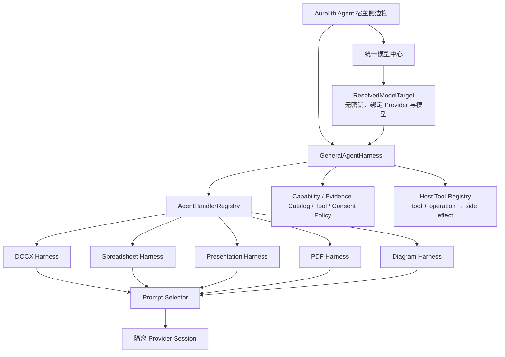

# Auralith Agent Harness 架构

## 目标

Auralith Agent 采用“一个通用运行时 + 多个文件格式专用 Harness”的结构。通用层不理解 DOCX、单元格或幻灯片的业务细节，只负责所有格式都必须一致的安全和执行规则；专用层负责对象读取、检索策略、格式语义和 Prompt。

## General Agent Harness

代码入口：`desktop-sdk/ChromiumBasedEditors/plugins/ai-agent/src/agent-harness/index.ts`

通用层负责：

- `document / spreadsheet / presentation / pdf / diagram / unknown` 编辑器上下文。
- 当前未保存文档版本的 `documentId + revisionId` 绑定。
- 不包含 API Key、Header 或 endpoint 凭证的 `ResolvedModelTarget`。
- Session 与 Task 状态机、取消、关闭、进度和确定性事件。
- 模型能力与验证等级检查；“用户声明”不能等同“已探测”。
- Evidence 数量、模态、来源和当前版本校验；Handler 只能引用 Host 为当前快照签发的不可变 `evidenceCatalog`。
- Tool 默认拒绝、显式 allow-list 和 Host 权威的文档级 Agent 模式；副作用由 Host Tool Registry 通过 `toolId + operation` 判定，Handler 不能自报降级。
- Tool 输入在授权前深复制并冻结；view/read-only Session 强制拒绝 write/execute。
- Handler 优先级路由、冲突检测和无适配器时 fail-closed。

Prompt、文件内容和模型输出都不能扩大 Tool 权限。只有 Host 创建的
`ToolPolicy` 与 Host 自己维护的文档级模式能授权副作用。模式是用户对一类
能力的持续授权，不是模型在每个 intent 中自报的字段：

| 模式 | Host 允许的能力 |
| --- | --- |
| `read` | 仅读取；所有 Word 写入在 capability、Harness 和 executor 层拒绝 |
| `comment` | 读取与 `document.comment`；不修改正文 |
| `auto` | 读取、评论与当前 production registry 中已经注册的有界 Word 写入 |

默认模式为 `read`。模式选择器由编辑器 Host 在 Agent iframe 外渲染并按文档
保存；Reader 只能读取并收窄该授权，不能设置或提升它。切换模式会撤销
尚未消费的 receipt 并广播新的 Host mode，但不会推进文档 `contextEpoch` 或
取消正在流式生成的只读回答。`comment/auto` 不显示逐操作确认卡，
但每个写入仍必须经过 Host authorization callback、一次性 receipt、目标重验、
冲突检查、scoped lock、postcondition 验证和原生 Undo。

## 专用 Harness 与 Prompt 系统

格式和任务 Prompt 位于：

- `src/agent-harness/format-profiles.ts`
- `src/agent-harness/prompt-selector.ts`

Prompt 栈顺序固定：

1. `auralith.general.core`
2. 文件格式 Prompt
3. 任务意图 Prompt
4. 模型能力 Prompt
5. 专用 Handler 的输出契约

选择依据只能来自宿主可信元数据：精确文件扩展名、MIME、已解析的文件格式、编辑器家族和任务意图。正文、图片 OCR、批注、公式结果及检索段不能参与 Prompt 选择。Word-processing 编辑器家族本身不等于 DOCX；RTF、ODT、TXT 等不会仅因位于文字编辑器中而误选 DOCX Prompt。

当前包含六种格式：

| Profile | 主要语义 |
| --- | --- |
| DOCX | 语义阅读顺序、章节、表格、页眉页脚、批注修订、锚定对象与页面关系 |
| Spreadsheet | Workbook、Sheet、Range、公式与显示值、透视表、筛选、图表 |
| Presentation | Slide、Notes、Master、对象层级、组合与页面构图 |
| PDF | 页面、原生文字、OCR、Annotation、表单、几何与重建不确定性 |
| Diagram | Node、Edge、Group、Container、方向、几何和图例 |
| Generic | 只使用显式结构，不虚构格式专属对象 |

当前包含 `read / summarize / answer / visualize / cowork / audit` 六种任务意图。`visualize` 与 `cowork` Prompt 只允许提出规格或变更方案，不代表已经获得渲染或写入权限。

## DOCX 专用能力当前接入

DOCX 是首个真实适配器：

- SDKJS 只读快照提供结构、页面、资产和来源导航。
- Reader 在完整快照前先运行轻量 preflight，统计页数、字符和视觉对象。
- 生产调用链固定为 `ReaderApp → GeneralAgentHarness → auralith.docx.reader Handler → ReaderModelService → Provider`。
- 每个任务由当前 manifest 生成 snapshot-bound `evidenceCatalog`；不存在、跨文档或跨版本的引用会在 General Harness 层再次拒绝。
- `ReaderModelService` 使用 General Prompt 栈，并追加 DOCX 结构化输出契约。
- 每次请求创建隔离的 Provider Session，模型、endpoint、工具、历史和 system prompt 不再污染聊天单例。
- 模型与 Provider 不匹配时，在发送任何文档证据前拒绝。
- 分析记录保存无密钥的 `modelTargetId / providerId / modelId / configurationRevision`。
- 远程证据发送与本地 embedding 下载是两个独立授权。

Spreadsheet、Presentation、PDF 与 Diagram 已有上下文契约和 Prompt Profile，但对象读取 Adapter 尚未实现；在 Adapter 注册前，General Harness 会返回不支持，而不是把它们误当成 DOCX。

## 受控 Word 选区写入接口

SDKJS Word 层提供首个可扩展写入契约：

- `GetSelectionTextFormatting`
- `ApplySelectionTextFormatting`

它不暴露任意 `callCommand`、Builder 脚本或 SDK 方法名，而是只接受版本化、严格校验的文字格式补丁。当前支持：

- 加粗、斜体、下划线、删除线
- 字体族
- 以 point 明确计量的字号 `fontSizePt`
- RGB/自动文字色
- RGB/无高亮

读取结果会明确区分统一值与 `mixed`，并签发绑定被检查选区、原生选区状态、精确容器闭包、`recalcId` 与独立 `contentRevision` 的单次 `selectionToken`。应用时必须同时提交 token、读取时的 `expectedRecalcId` 和 `expectedContentRevision`。移动当前光标不会改变被冻结的目标；连续且可证明与目标闭包不相交的编辑会返回 `rebased` 并继续。目标相交、revision gap、unknown、overflow、full-rescan、只读、协作锁、受保护内容、额外字段及模糊字号单位都会 fail-closed。一个组合补丁只创建一个历史操作，因此在它仍位于原生 History 栈顶时，一次普通 Undo 可以整体撤销；这不是可寻址的 Agent 专用 Undo token。

`GetSelectionTextFormatting` 是无副作用读取：它不会调用会申请协作锁的 SDK 方法。token 还绑定 SDK 原生文档位置路径（包含对象身份、位置、选区方向，以及跨脚注/尾注两个边界各自的内部起止路径），因此相同文字出现在另一个表格单元格、脚注或其他容器时也不能复用。

文字格式读取覆盖普通、East Asian 与 complex-script 字体槽。只有 `Bold/BoldCS`、`Italic/ItalicCS`、`FontSize/FontSizeCS` 及 Ascii/HAnsi/EastAsia/CS 字体族一致时才返回统一值；否则返回 `mixed`，不会把中文或阿拉伯文格式错误折叠成 ASCII 槽。写入会同步这些槽。SDKJS 原有的段落标记 `ItalicCS` 历史变更类型也已修正，从而保持读取、写入和 Undo 对称。

字体资源的解析和预加载在无锁阶段完成；网络协作下的写入只在最后一个很短的、按真实目标闭包计算的 scoped-lock 临界区内复核 revision、执行 mutation 和验证结果。人类用户在模型思考、Host 授权和远程锁等待期间仍可编辑文档。字体族必须在编辑器精确字体目录中存在；未知、加载中、加载失败或 DOCX 不支持的嵌入字体返回 `FONT_UNAVAILABLE`，不会静默回退后报告成功。

组合补丁使用专用历史描述并拒绝嵌套编辑事务。写入后先在尚未 Finalize 的 action 内读取并验证所有请求属性；不一致会尝试 Cancel + Finalize。只有原生目标和事务状态能够精确证明恢复时，才可以把这次尝试报告为已回滚；聚合格式值再次相等不是充分证明。只要 mutation kernel 已经尝试写入而恢复证明不完整，就返回不可自动重试的 `VERIFY_FAILED`，发布 unknown/full-rescan delta，且不得声称 `changed: false` 或净变化为零。仅在 mutation kernel 尚未写入的竞态中，才可以证明 stale/net-zero。Finalize 本身异常时会应急关闭本次事务拥有的 action、恢复 selection/recalculation 等编辑器状态，并且绝不盲目调用普通 Undo，因为该 history point 可能已经暴露给后续用户编辑。若补丁原本已全部满足，则返回 `changed: false`，不创建历史点也不递增内容版本。删除线读取把 SDKJS 的单删除线与双删除线都视为“已删除线”，因此 `{strikeout: false}` 不会把双删除线误判为无操作。

### 写入算法选择：强化版 A

本阶段只采用严格的顺序意图事务作为写入协议；不实现 B 的延迟 presentation queue。一个由当前 Host 模式允许的意图可以包含多个 op，因此批量修改八个标题不是八个独立事务：它应当是一次规范化、一次不可变 Host authorization、一次覆盖全部真实目标与 change type 的复合锁检查、一个 outer action、一次 pre-finalize 验证和一个原生 LIFO history point。

V1 仅允许 `all-or-nothing`。任一 target 无法解析、权限/保护/锁检查失败、模拟结果不合法或 postcondition 不匹配，整个意图在 Finalize 前失败并回滚。SDKJS 的 `changestype_*` 是分类枚举而不是有序数值，不能用 `maxChangetype(ops)` 代替逐目标、逐类型的复合锁声明；Word 混合操作应使用 `changestype_None + changestype_2_Element_and_Type_Array`，让每个元素携带精确类型。普通 selection-lock 调用自身负责收集锁集合，不能在它之前另做一轮会被清空的手工收集。批处理内部只能调用不会自行 `StartAction` 的 mutation kernel；任何会创建嵌套 history point 的高层 API 在证明“一意图一历史点”前不得注册。

B 中安全且独立的部分仅用于读取侧：manifest diff 现在可以区分 content / structure / location / presentation 指纹，同时保留总 `blocks` change set 兼容旧消费者。它不会放松增量读取门槛；只有连续、本地、单段落的纯文字 delta 走增量路径，未知、混合、非本地、revision gap、overflow、fullRescan 或 layout pending 仍完整刷新。由于当前 DOCX 快照尚未输出 run-level font/color/size，此能力不应被描述为“真实格式修改已经零索引成本”。

### 七个原子 Word 写能力与一个复合计划能力

源码中的 production capability registry 已启用下列七个原子写能力。它们都经过专用的 SDKJS 方法、有界 schema、Host write profile/executor、不透明一次性 receipt transport、Harness descriptor/runtime authorizer 和 Reader 端模式门禁；写入不进入只读 RPC allowlist，也不向 iframe 暴露 selection token、revision、SDKJS 方法名或原始文档定位。

| Capability | 当前严格范围 | SDKJS operations |
| --- | --- | --- |
| `document.selection-formatting@1.1` | 选区加粗、斜体、下划线、删除线、字体、point 字号、文字色和高亮 | `GetSelectionTextFormatting` / `ApplySelectionTextFormatting` |
| `document.selection-paragraph-formatting@1.0` | 最多 256 个段落的对齐、段前/段后、行距、左右和首行缩进 | `GetSelectionParagraphFormatting` / `ApplySelectionParagraphFormatting` |
| `document.selection-list-formatting@1.0` | 仅对主文档中已存在的项目符号/编号列表设置 0..8 内部层级，最多 128 个段落 | `GetSelectionListFormatting` / `ApplySelectionListFormatting` |
| `document.comment@1.0` | 在主文档的精确非空选区上添加具有 Host 端 Auralith 身份的原生批注；authorization 绑定精确 quote | `GetSelectionCommentTarget` / `AddSelectionComment` |
| `document.selection-table-cell-text@1.0` | **只支持单一 simple unmerged cell 的全部纯文本替换**：单段落、单普通 run、无字段/超链接/数学/图形/批注/嵌套表格/SDT，新文本最多 4096 UTF-16 code units，不含换行和控制字符 | `GetSelectionTableCellTextTarget` / `ReplaceSelectionTableCellText` |
| `document.body-text-replacement@1.0` | **只支持主文档整篇正文的纯文本清空/替换**：必须是明确整篇命令，生成前绑定 content revision，新正文最多 131072 UTF-16 code units，旧正文最多 1 MiB/2048 个顶层块 | `GetDocumentBodyTextTarget` / `ReplaceDocumentBodyText` |
| `document.text-replacement@1.0` | **只支持主正文内的精确目标**：当前非空单段落选区，或大小写/whole-word 策略明确的唯一/全部 exact matches；空 replacement 表示删除 | `GetDocumentTextReplacementTarget` / `ReplaceDocumentText` |

第八个 production 写能力 `document.word-edit-plan@1.0` 不是 generic
execute，而是复用上述已经证明过的 mutation kernel。它接受最多 12 个有序、ID
唯一的闭集操作：选区文字格式、段落格式、已有列表层级、末尾原生批注，以及必须独占
mutation group 的简单单元格纯文本替换。Host 冻结并验证整个 group；SDKJS 在一个
outer action 内重新解析目标、一次申请精确 scoped locks、顺序执行并验证全部
postcondition。任一步失败都精确回滚，不留下部分修改；成功只产生一个原生 History
point，一次普通 Undo 恢复整组。`read` 模式拒绝计划，`comment` 只允许全部为批注的
计划，`auto` 才允许已注册的五种 plan operation。整篇正文和 generic exact text
replacement 仍不在 V1 plan 中；body operation 仅被 schema 识别以强制“必须独占”后
返回 unsupported，不能伪装为已支持。

显式的即时 cowork 请求在确定性命令无法覆盖时，可以走一次有界模型 proposer。该
proposer 无工具循环、无重试，deadline 为 8 秒、输出上限 1024 tokens、问题上限
4096 字符、最多 12 个操作；它只看到问题、Host 模式、目标类别和允许的 text /
paragraph / list / comment schema，不看到正文、旧助手答案、revision、anchor、
capability、SDK 方法或私有 token。Host 为操作注入 ID、revision、capability 与一次性
选区 planning lease 后再进入相同 normalizer/authorizer。模型暂不生成 table-cell
operation。

planning lease 只用于当前非空真实选区，30 秒过期、每文档最多 16 个，并在 Inspect
时一次性消费。Reader 只收到 `sl-*` Host 句柄；SDKJS 的 `wlease-*` token、原生选区
状态、region journal 和 fingerprint 始终留在 Host/SDKJS。目标未变或只发生 SDKJS
证明的不相交编辑时可继续；相交变化、过期、重复消费、重启和 caret-only 都
fail-closed。它不是 durable anchor，因此模型计划不能排队、持久化、重启恢复或自动
重放；“当前段落/列表”没有真实选区时返回 `NO_SELECTION`，不会猜测目标。

生成式选区改写另使用只读内置能力 `document.selection-text@1.0`。它只允许调用
`GetSelectedText`，且参数固定为
`{Numbering:false, Math:false, TableCellSeparator:"\t", ParaSeparator:"\n"}`；返回值在
Reader 边界再次限制为最多 4096 UTF-16 code units、单行且无控制字符。选中文字仅用于
当前请求的目标校验和生成，不进入 Host document context，也不持久化为会话 memory。

### 与生俱来的聊天写入路由

Reader 的 production composer 现在只保留自然语言文本框、当前文档的模型选择器与
发送按钮，不再挂载文字格式、段落布局、列表或批注的手动按钮/弹层。按钮消失不会
删除底层能力：聊天输入包含一个无模型、闭集、确定性的命令路由器。当完整消息只匹配
一个零歧义命令时，提交事件会立即调用上表已注册的 Host receipt 写链路；它不要求
配置模型，也不弹出逐操作确认。当前支持中英文的：

- 选区加粗、斜体、下划线、删除线开关，字体、point 字号、`#RRGGBB` 文字色/高亮，以及文字颜色恢复为自动；
- 选中段落的对齐、间距、缩进和行距；
- 已存在列表的 1..9 级层级；
- 带有明确批注正文的选区批注；
- 带有明确新文本的当前简单单元格完整替换；
- 对当前选中文字进行明确的替换、改写、翻译、润色或删除；
- 把一个明确 literal 的唯一匹配替换/删除，或在用户明确说“所有/全部/all/every”或给出等价全文匹配范围时处理全部匹配；
- 明确指向整篇正文的清空，或“删除/替换整篇正文并生成……”命令。

带正文 payload 的批注与单元格命令统一接受 ASCII `:` 和桌面输入法可能保留的全角 `：`；两种分隔符进入相同的长度、控制字符、模式和单一意图校验，不会扩大可写范围。

`read` 不会路由任何写入，`comment` 只路由批注或全批注复合计划，`auto` 才路由
全部已注册原子能力和复合计划。
整篇正文语法先于窄范围语法解析，因此“清空整篇正文”仍进入
`document.body-text-replacement`，不会退化成局部 exact-match 删除。未显式声明
“所有/全部/all/every”或等价全文匹配范围的 exact literal 默认为 `unique`：零匹配返回 `NO_MATCH`，多于
一个匹配返回 `AMBIGUOUS_TARGET`，绝不静默扩大为 `all`。空 replacement 是显式删除，
不是独立的绕过写接口。

确定性本地写入的 input readiness 与模型 readiness 分离，但发送门禁仍按解析出的
精确 capability 判断；“只有评论能力”不能放行删除，“只有文字格式能力”也不能放行
段落或正文写入。生成式改写必须同时满足可运行 Reader 状态、manifest、文档 Agent
session、模型能力和远程证据授权。问句、多操作句、没有选区的选区命令、缺失/含糊 target、越界参数、多行输入和无法
闭集解析的自由请求仍不触发写入，而是要求澄清或留在普通问答路径。自然语言只决定
已注册 capability 的 target kind、occurrence 和 replacement；模型只能生成最终替换
文本，不能选择 SDKJS 方法、位置、receipt、模式或锁。

整篇替换采用两阶段 no-pause 协议：提交时记录 `baseContentRevision`，模型生成与
检索期间不持有编辑锁；生成结束后 Host/SDKJS 重新检查同一文档、正文 revision、
精确正文文本和顶层块集合，只在全部一致时申请短 scoped lock 并提交一个原生
history point。人类在生成期间的任何正文修改都会得到 `STALE`，不会被 Agent
静默覆盖。模型只负责生成最终正文；权限、目标、事务、回滚证明和 receipt 均由
闭集 Host/SDKJS 控制面决定。

生成式选区改写在提交时通过 `document.selection-text` 捕获非空 exact quote；模型
生成期间不持锁。生成结束后，`document.text-replacement` inspect 必须再次证明当前
目标仍是完全相同的 quote、位于主正文的单一段落、没有 drawing，且 Track Revisions
关闭。inspect 签发的 token/Host receipt 再绑定 document、region、revision、模式和
规范化 replacement；任一相交漂移、选区移动或 quote 变化都会在 mutation 前失败，
不会改写“最像”的另一段文字。

该能力的硬边界为：`expectedText` 与 `replacementText` 各最多 4096 UTF-16 code units，
`searchText` 最多 1024；exact-match 最多 256 处、最多影响 128 个主正文段落。文本必须
是合法、无控制字符的单行 Unicode；header/footer、批注正文、脚注/尾注、文本框和其他
非主正文故事均不在目标集合。Track Revisions 开启时 fail-closed；当前版本不伪装成
带修订标记的替换。

每个选区写任务都使用不可变的 Host-owned normalized view 和一次性 receipt。
在 `comment/auto` 模式中该 view 进入审计与结果呈现，而不会弹出逐操作确认卡。
只能在 executor 派发前取消；派发后 SDKJS/Host 权威结果必须保留。
`committed` 或 `commitState: unknown` 都是不可自动重试的终态；会话层不能
把它们降级成取消或可重试失败。一个获 Host 授权的意图仅生成一个 SDKJS
原生 LIFO history point；只要该 point 仍在栈顶，一次普通 Undo 整体撤销，
不存在隐藏的 Agent 专用 Undo 栈或可寻址 Undo token。

### no-pause cowork 与保守冲突边界

读取、模型生成、模式授权检查和资源预加载不获取文档交互锁。Host 签发
receipt 后先复核目标 revision，再只申请冻结 target closure 需要的远程 scoped
locks；锁回调后再复核一次，然后在不包含网络等待的同步 mutation 临界区中
完成写入、postcondition 验证和 Finalize，并在 `finally` 恢复人类当时的实时
光标/选区。连续、有界、可解释且与目标闭包不相交的变更可 rebase；相交、
revision gap、unknown、overflow、full-rescan 或模糊定位会在 mutation 前
fail-closed。

当前表格变更源尚只能保守地标记 table-level region。因此，人类修改同一表格的其他单元格时，待写 token 也会被当作冲突；它会安全地返回 stale/conflict，不会暂停用户或写错单元格。在变更流增加持久 cell identity 之前，不得放宽这个保守边界。文本替换同样只在 inspect 后申请最终段落集合的短 scoped lock；生成、搜索意图解析和只读选区捕获都不暂停用户。Host outcome 只返回 `changed`、`targetResolution`、`targetKind`、`occurrence` 与有界计数，不泄露选中文字或 selection token；成功写入只有一个 Host receipt 和一个原生 LIFO Undo 点。

SDKJS 接收并回放已有协作变更的路径仍有独立的 fail-closed 资源/世代/owner 保护；那条 incoming replay 路径与 Agent 发出的 scoped-lock 写入不是同一个事务。

上述 production 源码路径已接通。较早安装版真实窗口曾观察到三模式切换、Auto 模式的确定性加粗/整篇正文写入和普通原生 Undo；这些只是历史正向证据，不能证明 2026-08-11 当前源码/安装包。当前 GUI 证据仍需在新安装后复测，尤其不能把 natural-language-only composer、新 selection/unique/all/delete 路由或 text-replacement 的 apply/fail/cancel/Undo 写成已由真实窗口证实。

## 新增文件格式的实施契约

1. 在宿主层提供可信的 `EditorContext` 和精确 `revisionId`。
2. 实现只读 Snapshot Adapter，并为所有对象返回受支持、元数据、视觉、不支持或失败分类。
3. 注册只处理对应 `documentKinds + taskKinds` 的 `AgentTaskHandler`。
4. 添加格式 Prompt Profile；文件内容不得参与 Profile 选择。
5. 为任务声明 Capability、Evidence 与 ToolPolicy。
6. 通过 Handler 路由、Prompt 注入、版本过期、取消、权限和真实文件黄金集测试。

## 测试边界

2026-08-21 当前源码基于已推送子模块 `desktop-sdk@4b107d01`、
`web-apps@ae954dc3c`、`sdkjs@f1946d70c`。Node.js 20 全量 Vitest 164 个
文件、2,004/2,004 tests，Chromium Playwright 287/287、全部十个 Auralith
SDKJS QUnit pages、isolated Word Closure、TypeScript、Biome、Host
profile/executor/transport tests 与 3,350-module Vite production build 均通过；
根 `4996bae` 记录了三个 gitlink，后续 `fast --network` 证明精确 fork
fetchability 并重复聚焦跨层门禁；验证器只写入临时目录。guarded
`--stage-only` 与正式 `--install` 随后均通过。当前 live Test.app 与
`20260821-030557` 嵌套 rollback app 均通过 strict deep signature，live bundle
ID 为 `com.auralith.editer.test`，installed/rollback manifests 各自验证 320/320
项。macOS 安装后仍锁屏，因此这些是当前包结构证据，不是 stream/Stop、adaptive
web、global audit、queue、multi-step apply/fail/cancel 或 native Undo 的窗口证据。
在可丢弃 DOCX 上完成真实交互前，不得把这些路径写成 installed-GUI verified。

2026-08-11 当前源码结果基于已推送子模块 `desktop-sdk@f010aa45`、
`web-apps@fa600a69c`、`sdkjs@e9b392c12`：desktop 全量 Vitest 150 个文件、
1,741/1,741 tests，Biome 514 个文件、Reader TypeScript 与 `npx vite build`
（3,336 modules）通过；自然语言/Composer 聚焦测试 4 files/112 tests 和更新后的
Chromium composer 主路径 1/1 通过。根 `a6bfacb` 的 `full --network` 继续通过三个
fork 精确 fetchability、Host contracts、desktop 150 files/1,741 tests、Chromium
278/278、全部九个 SDKJS pages、isolated Word Closure 与 3,336-module Vite build；
没有写入 tracked 或 packaged deploy assets。`--stage-only` 也通过 payload、production
entry、bundle shape、deep signature 与 designated requirement。正式 `--install` 因
macOS 锁屏且旧 Test.app 正在运行而安全停止，因此当前安装版与 GUI 证据尚未更新。

此前 2026-08-10 checkpoint 的 Reader Chromium Playwright 21/21、Host 聚焦测试 96/96，
最终 `targetResolution: "rebased"` 接受回归 4 files/32 tests 通过。
SDKJS 新增 text-replacement QUnit 16 tests/105 assertions，并继续通过 paragraph
14/67、comment 21/150、list 13/85、table-cell 20/160、body 4/19、remote cowork
24/262。根 gitlink 提交后的 `fast --network` 通过三个 fork 的精确 fetchability、
focused Agent 50 files/370 tests、全部聚焦 SDKJS pages 与 isolated Vite build。
最终 `full --network` 也通过：Host contracts、desktop 150 files/1,714 tests、
Chromium Playwright 278/278、全部九个 Auralith SDKJS QUnit pages、isolated Word
Closure 与 3,346-module Vite build 均为绿色，且没有写入 tracked 或 packaged
deploy assets。

本轮 `--stage-only` 与最终正式 `--install` 均成功；最终安装包通过 3,346-module
Vite build、Word Closure、payload、production entry、bundle shape、strict deep
signature 与 designated-requirement 检查。当前回滚点是
`/Users/openclaw_server/Applications/Auralith_Editer Test.app.rollback/20260810-141832`。
macOS 当时处于锁屏状态，因此没有对当前包执行 GUI 交互复测；旧包的可见成功不能
替代当前包的 selection/exact replacement、失败/取消/冲突和 Undo 矩阵。
最终 `desktop-sdk@27f7b107` 仅补浏览器 E2E fixture，不改变已安装的 production
payload，因此无需为该测试提交再次替换 Test.app。

源码层面已存在专用 receipt transport、production Harness 注册、runtime authorizer、Host mode/executor、七个原子 Reader 写操作链、一个复合 Word plan 链、`document.selection-text` 与 selection-planning-lease 只读链，以及 no-pause scoped-lock 路径。自动化与安装事务通过仍不等同于已安装应用的 GUI 运行时 E2E；未执行的窗口交互不得推断为通过。

- Harness/Prompt 单元测试覆盖状态机、取消、能力、Evidence、ToolPolicy、格式冲突、降级和提示注入。
- Model Center 测试覆盖 endpoint 身份轮换、能力隔离、密钥引用迁移和模型目录竞态。
- DOCX 专用读取管线覆盖快照一致性、视觉缓存隔离、Provider Session 隔离、能力探测和来源引用。
- Playwright 覆盖“模型中心选择模型 → DOCX 读取”以及五种编辑器宿主。
- SDKJS QUnit 覆盖轻量 preflight 与完整快照的执行边界。
- 七个原子 Word 写契约与复合 plan 覆盖严格输入、mixed/结构状态、单次 token、原生位置与 quote/revision 绑定、版本/选区过期、无副作用读取、scoped locks、整组事务回滚、单个原生 Undo，以及 committed/unknown 结果不重试；selection-text 与 planning lease 另覆盖固定 RPC 参数、TTL、one-shot、长度/控制字符和不持久化边界。
