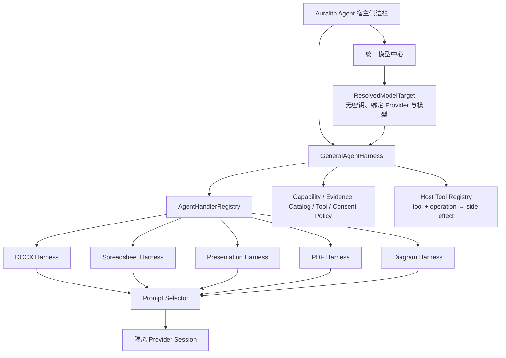

# Auralith Agent Harness 架构

## 目标

Auralith Agent 采用“一个通用运行时 + 多个文件格式专用 Harness”的结构。通用层不理解 DOCX、单元格或幻灯片的业务细节，只负责所有格式都必须一致的安全和执行规则；专用层负责对象读取、检索策略、格式语义和 Prompt。



## General Agent Harness

代码入口：`desktop-sdk/ChromiumBasedEditors/plugins/ai-agent/src/agent-harness/index.ts`

通用层负责：

- `document / spreadsheet / presentation / pdf / diagram / unknown` 编辑器上下文。
- 当前未保存文档版本的 `documentId + revisionId` 绑定。
- 不包含 API Key、Header 或 endpoint 凭证的 `ResolvedModelTarget`。
- Session 与 Task 状态机、取消、关闭、进度和确定性事件。
- 模型能力与验证等级检查；“用户声明”不能等同“已探测”。
- Evidence 数量、模态、来源和当前版本校验；Handler 只能引用 Host 为当前快照签发的不可变 `evidenceCatalog`。
- Tool 默认拒绝、显式 allow-list 和用户审批；副作用由 Host Tool Registry 通过 `toolId + operation` 判定，Handler 不能自报降级。
- Tool 输入在审批前深复制并冻结；view/read-only Session 强制拒绝 write/execute。
- Handler 优先级路由、冲突检测和无适配器时 fail-closed。

Prompt、文件内容和模型输出都不能扩大 Tool 权限。只有 Host 创建的 `ToolPolicy` 和用户审批能授权副作用。

## 专用 Harness 与 Prompt 系统

格式和任务 Prompt 位于：

- `src/agent-harness/format-profiles.ts`
- `src/agent-harness/prompt-selector.ts`

Prompt 栈顺序固定：

1. `auralith.general.core`
2. 文件格式 Prompt
3. 任务意图 Prompt
4. 模型能力 Prompt
5. 专用 Handler 的输出契约

选择依据只能来自宿主可信元数据：精确文件扩展名、MIME、已解析的文件格式、编辑器家族和任务意图。正文、图片 OCR、批注、公式结果及检索段不能参与 Prompt 选择。Word-processing 编辑器家族本身不等于 DOCX；RTF、ODT、TXT 等不会仅因位于文字编辑器中而误选 DOCX Prompt。

当前包含六种格式：

| Profile | 主要语义 |
| --- | --- |
| DOCX | 语义阅读顺序、章节、表格、页眉页脚、批注修订、锚定对象与页面关系 |
| Spreadsheet | Workbook、Sheet、Range、公式与显示值、透视表、筛选、图表 |
| Presentation | Slide、Notes、Master、对象层级、组合与页面构图 |
| PDF | 页面、原生文字、OCR、Annotation、表单、几何与重建不确定性 |
| Diagram | Node、Edge、Group、Container、方向、几何和图例 |
| Generic | 只使用显式结构，不虚构格式专属对象 |

当前包含 `read / summarize / answer / visualize / cowork / audit` 六种任务意图。`visualize` 与 `cowork` Prompt 只允许提出规格或变更方案，不代表已经获得渲染或写入权限。

## DOCX 专用能力当前接入

DOCX 是首个真实适配器：

- SDKJS 只读快照提供结构、页面、资产和来源导航。
- Reader 在完整快照前先运行轻量 preflight，统计页数、字符和视觉对象。
- 生产调用链固定为 `ReaderApp → GeneralAgentHarness → auralith.docx.reader Handler → ReaderModelService → Provider`。
- 每个任务由当前 manifest 生成 snapshot-bound `evidenceCatalog`；不存在、跨文档或跨版本的引用会在 General Harness 层再次拒绝。
- `ReaderModelService` 使用 General Prompt 栈，并追加 DOCX 结构化输出契约。
- 每次请求创建隔离的 Provider Session，模型、endpoint、工具、历史和 system prompt 不再污染聊天单例。
- 模型与 Provider 不匹配时，在发送任何文档证据前拒绝。
- 分析记录保存无密钥的 `modelTargetId / providerId / modelId / configurationRevision`。
- 远程证据发送与本地 embedding 下载是两个独立授权。

Spreadsheet、Presentation、PDF 与 Diagram 已有上下文契约和 Prompt Profile，但对象读取 Adapter 尚未实现；在 Adapter 注册前，General Harness 会返回不支持，而不是把它们误当成 DOCX。

## 受控文字格式接口

SDKJS Word 层提供首个可扩展写入契约：

- `GetSelectionTextFormatting`
- `ApplySelectionTextFormatting`

它不暴露任意 `callCommand`、Builder 脚本或 SDK 方法名，而是只接受版本化、严格校验的文字格式补丁。当前支持：

- 加粗、斜体、下划线、删除线
- 字体族
- 以 point 明确计量的字号 `fontSizePt`
- RGB/自动文字色
- RGB/无高亮

读取结果会明确区分统一值与 `mixed`，并签发绑定被检查选区、原生选区状态、精确容器闭包、`recalcId` 与独立 `contentRevision` 的单次 `selectionToken`。应用时必须同时提交 token、读取时的 `expectedRecalcId` 和 `expectedContentRevision`。移动当前光标不会改变被冻结的目标；连续且可证明与目标闭包不相交的编辑会返回 `rebased` 并继续。目标相交、revision gap、unknown、overflow、full-rescan、只读、协作锁、受保护内容、额外字段及模糊字号单位都会 fail-closed。一个组合补丁只创建一个历史操作，因此在它仍位于原生 History 栈顶时，一次普通 Undo 可以整体撤销；这不是可寻址的 Agent 专用 Undo token。

`GetSelectionTextFormatting` 是无副作用读取：它不会调用会申请协作锁的 SDK 方法。token 还绑定 SDK 原生文档位置路径（包含对象身份、位置、选区方向，以及跨脚注/尾注两个边界各自的内部起止路径），因此相同文字出现在另一个表格单元格、脚注或其他容器时也不能复用。

文字格式读取覆盖普通、East Asian 与 complex-script 字体槽。只有 `Bold/BoldCS`、`Italic/ItalicCS`、`FontSize/FontSizeCS` 及 Ascii/HAnsi/EastAsia/CS 字体族一致时才返回统一值；否则返回 `mixed`，不会把中文或阿拉伯文格式错误折叠成 ASCII 槽。写入会同步这些槽。SDKJS 原有的段落标记 `ItalicCS` 历史变更类型也已修正，从而保持读取、写入和 Undo 对称。

当前同步 V1 只执行单用户编辑事务。网络协作需要等待宿主的异步锁回调，因此会稳定返回 `ASYNC_LOCK_REQUIRED`，不会在服务器尚未授权时报告成功。字体族也必须在编辑器精确字体目录中存在，且此次粗体/斜体组合所需的底层字体文件已经加载；未知、加载中、加载失败或 DOCX 不支持的嵌入字体返回 `FONT_UNAVAILABLE`，不会静默回退字体后仍报告成功。

组合补丁使用专用历史描述并拒绝嵌套编辑事务。写入后先在尚未 Finalize 的 action 内读取并验证所有请求属性；不一致会尝试 Cancel + Finalize。只有原生目标和事务状态能够精确证明恢复时，才可以把这次尝试报告为已回滚；聚合格式值再次相等不是充分证明。只要 mutation kernel 已经尝试写入而恢复证明不完整，就返回不可自动重试的 `VERIFY_FAILED`，发布 unknown/full-rescan delta，且不得声称 `changed: false` 或净变化为零。仅在 mutation kernel 尚未写入的竞态中，才可以证明 stale/net-zero。Finalize 本身异常时会应急关闭本次事务拥有的 action、恢复 selection/recalculation 等编辑器状态，并且绝不盲目调用普通 Undo，因为该 history point 可能已经暴露给后续用户编辑。若补丁原本已全部满足，则返回 `changed: false`，不创建历史点也不递增内容版本。删除线读取把 SDKJS 的单删除线与双删除线都视为“已删除线”，因此 `{strikeout: false}` 不会把双删除线误判为无操作。

### 写入算法选择：强化版 A

本阶段只采用严格的顺序意图事务作为写入协议；不实现 B 的延迟 presentation queue。一个“用户批准的意图”可以包含多个 op，因此批量修改八个标题不是八个独立事务：它应当是一次规范化、一次不可变审批、一次覆盖全部真实目标与 change type 的复合锁检查、一个 outer action、一次 pre-finalize 验证和一个原生 LIFO history point。

V1 仅允许 `all-or-nothing`。任一 target 无法解析、权限/保护/锁检查失败、模拟结果不合法或 postcondition 不匹配，整个意图在 Finalize 前失败并回滚。SDKJS 的 `changestype_*` 是分类枚举而不是有序数值，不能用 `maxChangetype(ops)` 代替逐目标、逐类型的复合锁声明；Word 混合操作应使用 `changestype_None + changestype_2_Element_and_Type_Array`，让每个元素携带精确类型。普通 selection-lock 调用自身负责收集锁集合，不能在它之前另做一轮会被清空的手工收集。批处理内部只能调用不会自行 `StartAction` 的 mutation kernel；任何会创建嵌套 history point 的高层 API 在证明“一意图一历史点”前不得注册。

B 中安全且独立的部分仅用于读取侧：manifest diff 现在可以区分 content / structure / location / presentation 指纹，同时保留总 `blocks` change set 兼容旧消费者。它不会放松增量读取门槛；只有连续、本地、单段落的纯文字 delta 走增量路径，未知、混合、非本地、revision gap、overflow、fullRescan 或 layout pending 仍完整刷新。由于当前 DOCX 快照尚未输出 run-level font/color/size，此能力不应被描述为“真实格式修改已经零索引成本”。

### 本地 cowork 与远程协作边界

本地读取和单用户格式事务已经采用快照隔离：模型基于不可变快照生成时，用户可以继续输入；格式写入使用冻结目标，在提交前只接受可证明不相交的 revision rebase，并在 `finally` 恢复用户当时的实时光标/选区。它的临界区是同步的 SDKJS mutation，不包含网络等待。

网络协作分为两个不同方向，不能混为一个“远程写入已完成”的能力：

- Agent 发出的 selection-formatting 写入仍需要异步服务器锁，当前稳定返回 `ASYNC_LOCK_REQUIRED`，没有生产 transport，也没有启用远程 apply。
- SDKJS 接收并回放已有协作变更的路径已经做 fail-closed 加固：FontLoader、recalculation pause 或 `isSaveFonts_Images` 已忙时，会在 mutation 前无所有权地延迟并受超时约束；已有 Auralith resource ticket/receipt 则拒绝覆盖。入口、observer、Undo、`Apply_OtherChanges` 和资源交接后都会复核 batch、document generation 与 API owner；Undo 在产生效果前消费且冻结，部分 Undo 或部分 `Apply_Data` 失败会丢弃不确定队列、发布保守 delta、释放其拥有的资源，并锁存为需要 reload/resync，禁止继续远程写。
- 字体/图片回调携带不可变的 batch、generation、owner 和 editor API receipt；旧 URL 回调不能落入替换后的 API。资源加载等待有 120 秒 watchdog，超时只执行一次 terminal completion，释放本批次拥有的 global/selection/recalculation/interaction 状态，并拒绝迟到 receipt。文档替换会终止仍处于 starting/awaiting 的 generation-bound batch；finishing 中的同步重入替换会在每个语义步骤后失效旧 batch，停止后续 recalc/update/form，把 unknown delta 与错误留在旧 document/API，且只释放旧 owner。

这些措施提高的是“已收到远程变更的失败安全性”，不是 no-pause cowork。当前回放在异步字体/图片加载期间仍可能持有全局交互锁、选区锁和 recalculation pause。真正的远程 no-pause 仍需在无锁阶段预解析/预加载资源，再复核 generation、revision 与目标区域，最后只在很短的 mutation 临界区获取 scoped lock。

Agent 侧对应的 Host Tool 描述为：

```text
document.selection-formatting / inspect → read
document.selection-formatting / apply   → write
```

类型化契约和 Host-owned client 位于：

`desktop-sdk/ChromiumBasedEditors/plugins/ai-agent/src/office-tools/selection-text-formatting.ts`

General Harness 已把取消分成两个确定性阶段：`read` 保留普通协作取消；`write / network / execute` 只允许在 executor 派发前取消。一旦进入潜在不可逆派发，`cancelTask` 返回 `false`，调用方 AbortSignal 与 `closeSession` 不再中断内部 executor。executor 的 fulfilled 结果保持权威；reject 会锁存为 `TOOL_EXECUTION_UNCERTAIN`（`commitState: unknown`、`retryable: false`），即使 handler 捕获该错误也不能把任务继续标成成功。这个契约防止把已提交操作误报为取消并自动重试，但生产 formatting transport 尚未注册，因此仍需把 Host receipt 和 SDKJS 权威结果端到端接入后才能启用。

当前生产 Reader 仍为 `deny-all`，内置 iframe 的五方法快照桥也仍保持只读。Host Tool Executor、真实宿主上下文和非模态用户审批卡已经实现，但保持在 false production gate 后；selection token、revision 和 SDK 方法名都不会暴露给 Reader。启用 `apply` 前仍必须完成独立 edit task、专用生产工具 transport、生产 Harness descriptor 注册、真实 runtime authorizer（宿主能力可用性与一次性审批）、将上述 cancellation boundary 接到真实 Host receipt/SDKJS result、不会冻结画布的远程 scoped lock，以及已安装应用中的 inspect → approve → apply/failure/stale/read-only/lock/cancel/Undo E2E。模型输出不得直接调用 SDKJS 写接口，任何 prompt 或 UI 也不得宣称已经具备生产写入或远程 no-pause 能力。

## 新增文件格式的实施契约

1. 在宿主层提供可信的 `EditorContext` 和精确 `revisionId`。
2. 实现只读 Snapshot Adapter，并为所有对象返回受支持、元数据、视觉、不支持或失败分类。
3. 注册只处理对应 `documentKinds + taskKinds` 的 `AgentTaskHandler`。
4. 添加格式 Prompt Profile；文件内容不得参与 Profile 选择。
5. 为任务声明 Capability、Evidence 与 ToolPolicy。
6. 通过 Handler 路由、Prompt 注入、版本过期、取消、权限和真实文件黄金集测试。

## 测试边界

2026-08-04 的 Node.js 20 源码/测试构建验证通过：Agent Vitest 105 个文件、1446 个测试；Agent 与 Reader TypeScript；Biome 407 个文件；Host write executor 17/17；typed Office selection-formatting 16/16；Vite 3290 个 transformed modules；完整 Chromium Playwright E2E 254/254。SDKJS QUnit 通过 incoming remote-collaboration 9 个测试、145 个断言，既有 `pluginsApi` 36 个测试、383 个断言，以及 multimodal snapshot 28 个测试、315 个断言；desktop Word Closure 编译通过。

上述结果证明当前源码契约与测试夹具，不等同于已安装应用的生产写入运行时 E2E。专用 transport、生产注册、真实 authorizer、取消路径和 no-pause 远程锁尚未连通，因此 production write gate 继续关闭。

- Harness/Prompt 单元测试覆盖状态机、取消、能力、Evidence、ToolPolicy、格式冲突、降级和提示注入。
- Model Center 测试覆盖 endpoint 身份轮换、能力隔离、密钥引用迁移和模型目录竞态。
- DOCX 专用读取管线覆盖快照一致性、视觉缓存隔离、Provider Session 隔离、能力探测和来源引用。
- Playwright 覆盖“模型中心选择模型 → DOCX 读取”以及五种编辑器宿主。
- SDKJS QUnit 覆盖轻量 preflight 与完整快照的执行边界。
- 文字格式契约覆盖严格输入、mixed 值、单次 token、原生位置绑定、版本/选区过期、无副作用读取、协作 fail-closed、精确字体、事务回滚、point 字号、组合补丁和单步 Undo。
