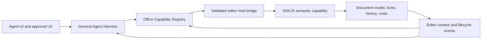

# Auralith AI-native Office architecture

Status: normative architecture and delivery contract
Implementation status refreshed: 2026-08-05; full automated verification and
test-app installation passed, while installed-app GUI evidence remains pending

This document is the source of truth for how Auralith_Editer adds AI-facing
Office capabilities. It covers SDKJS document semantics, editor context,
transactions and Undo, the built-in host bridge, the Agent runtime, UI
components, packaging, and release evidence.

`AURALITH_UI_SYSTEM.md` remains authoritative for visual tokens and component
presentation. `MACOS_HANDOFF.md` remains authoritative for repository checkout
and submodule handling. This document is authoritative for capability maturity,
cross-layer ownership, and the conditions required before a capability may be
presented as production-ready.

The words MUST, MUST NOT, SHOULD, and MAY are normative.

## Core invariant

An Office capability MUST begin in the editor's document model, never in a
button, sidebar component, tool description, or prompt.

The required implementation order is:

1. Define the operation in SDKJS terms: exact document target, supported
   values, failure modes, and editor invariants.
2. Define the context contract: editor kind, document identity, revision,
   mode, selection identity, permissions, and locks.
3. Define transaction and Undo behavior, including rollback and collaboration.
4. Define a versioned, bounded request/response schema and structured errors.
5. Classify every operation's side effect and approval requirements in a
   host-owned capability registry.
6. Expose only that capability through a validated editor host bridge.
7. Register the capability with the Agent Harness and enforce task policy.
8. Add preview, approval, progress, completion, and error UX.
9. Add prompts and model-facing tool descriptions last.

A UI control or prompt can reveal a capability; it cannot create one. A generic
`ExecuteCommand`, arbitrary script, or prompt-convention shortcut is not an
Office capability and MUST NOT be used to bypass these layers.

## Maturity vocabulary

These terms describe integration maturity, not marketing readiness:

- **native**: the capability originates in SDKJS semantics and is connected
  through context, policy, host, Agent, UI, tests, and the verified test-build
  package for its declared scope.
- **partial**: meaningful implementation exists, but at least one mandatory
  layer or release gate is missing. Partial capabilities MUST remain disabled
  in production.
- **shell**: the common Agent entry, configuration, or unsupported-state UI is
  present, but no document capability is connected for that editor.
- **absent**: no versioned semantic capability contract exists.

`native` does not by itself mean that a public installer has shipped. Public
release readiness requires every release gate in this document.

## Confirmed current state

The current implementation is split across three modified submodules:

- `sdkjs` owns Word document snapshots and the five bounded Word selection-write
  semantics described below.
- `web-apps` owns the built-in editor launcher, panel, Advanced Settings
  integration, theme mapping, and restricted iframe bridge.
- `desktop-sdk/ChromiumBasedEditors/plugins/ai-agent` owns the Agent UI,
  provider configuration, General Agent Harness, document Reader, retrieval,
  citations, typed Office clients, and tests.

The `plugins/ai-agent` path is historical. The production-facing editor surface
is loaded as a built-in feature and is not registered by plugin GUID.

### Capability and surface matrix

| Capability or surface | Current maturity | Release state | Confirmed implementation | Missing before broader release |
| --- | --- | --- | --- | --- |
| Built-in Agent entry in editor web-app headers | native, test-build scope | test-build verified | One common launcher/panel host is injected into document, spreadsheet, presentation, PDF, and diagram editors | Public installer/release certification and native Qt start-page integration |
| Provider/model settings and remote-evidence consent | native, test-build scope | test-build verified | Shared settings view, Advanced Settings host integration, model capability checks, local storage synchronization, and explicit remote-document consent | Central capability negotiation must consume the same registry as Office tools |
| DOCX multimodal snapshot, retrieval, citations, and source navigation | native, DOCX read-only scope | test-build verified | Five bounded SDKJS snapshot methods, revision checks, lazy assets, evidence catalog, citations, document-change invalidation, and a registry-derived Agent bridge/manifest | General release certification; generate the web-apps host projection instead of relying only on a parity test |
| General Agent Harness lifecycle, evidence policy, and tool policy | partial, source path connected | production source enabled for declared capabilities; release evidence pending | Typed lifecycle, canonical Office registry, production descriptors, host-owned runtime authorizer, immutable one-shot approval receipts, cancellation boundary, authoritative outcome propagation, and no-retry handling for committed/unknown dispatch | Current installed-app integration E2E and broader migration of generic chat to the same control plane |
| `document.selection-formatting@1.1` | partial, full source path | production source enabled; installed-app E2E pending | Side-effect-free inspect plus bounded text-format apply; mixed script-aware properties, exact fonts, no-lock preload, region rebase, short scoped remote lock, immutable approval, one native LIFO Undo | Current package/hash refresh and installed-app inspect/approve/apply/fail/cancel/Undo evidence |
| `document.selection-paragraph-formatting@1.0` | partial, full source path | production source enabled; installed-app E2E pending | Inspect/apply for alignment, spacing and indents across at most 256 selected paragraphs, with region rebase, scoped locks, rollback proof and one native LIFO Undo | Current package/hash refresh and installed-app E2E |
| `document.selection-list-formatting@1.0` | partial, full source path | production source enabled; installed-app E2E pending | Inspect/set level 0..8 for existing bullet/numbered lists in a bounded plain main-document selection, with scoped locks and one native LIFO Undo | List creation/conversion/renumbering remain out of scope; current installed-app E2E pending |
| `document.comment@1.0` | partial, full source path | production source enabled; installed-app E2E pending | Exact-quote-bound inspect/add for a native Host-authored Auralith comment on a plain main-document selection, with durable native receipt, scoped locks and one native LIFO Undo | Resolve/reply/revision-review operations remain absent; current installed-app E2E pending |
| `document.selection-table-cell-text@1.0` | partial, deliberately narrow source path | production source enabled; installed-app E2E pending | Full plain-text replacement of exactly one simple unmerged cell, bounded to one paragraph/ordinary run and 4096 UTF-16 code units, with table+paragraph scoped locks, postcondition verification and one native LIFO Undo | Merged/multi-cell/rich/nested/structural table edits remain absent; same-table changes conservatively conflict; current installed-app E2E pending |
| Other Word mutations such as paragraph structure, list creation, table structure, comment resolution, and revisions | absent | blocked | Existing editor internals only; no enabled Auralith capability contract | Full SDKJS-first capability lifecycle |
| Spreadsheet document intelligence | shell | blocked for document operations | Common Agent entry and model configuration | Spreadsheet context, semantic read contract, selection/range identity, calculation/revision rules, and safe mutations |
| Presentation document intelligence | shell | blocked for document operations | Common Agent entry and model configuration | Slide/object context, semantic read contract, selection identity, transaction and Undo rules |
| PDF document intelligence | shell | blocked for document operations | Common Agent entry and model configuration | PDF reading/form context, capability-specific permissions, and mutation semantics |
| Diagram document intelligence | shell | blocked for document operations | Common Agent entry and model configuration | Page/node context, semantic graph contract, selection identity, and mutation semantics |
| Shared Auralith UI system | partial | usable with migration work remaining | Semantic tokens, theme registry, compact sidebar, RTL, reduced-motion and forced-colors foundations; Button/Checkbox contracts and tool-approval keyboard safety are now enforced | Complete primitive migration, semantic FormField controls, controller/view separation, localization, and coverage gates |
| Native Qt start page and title-bar integration | absent | blocked | Integration points are known | Rebuilt `desktop-apps` Qt shell and native lifecycle tests |
| macOS isolated test-app installation | partial | current dedicated Test.app installed and statically verified; GUI E2E pending | Guarded fixed-target dry-run/stage/install workflow, isolated builds, payload manifest/hash verification, same-volume transactional replacement, rollback and deep signing checks; current transaction completed with rollback `20260805-164918` | Installed-app GUI E2E and public release certification |
| Cross-submodule verification | native, repository-gate scope | fast/full verified at exact pushed gitlinks | `tools/verify-auralith.sh` checks Node 20, exact gitlinks/remotes/fetchability, cross-layer contracts, focused/full Agent, Host, SDKJS, Vite and Closure paths without overwriting deploy assets | Hosted CI and artifact publication |

### Production Word selection-write boundary

The source production gate, dedicated receipt transport, Harness descriptors,
runtime authorizer, Host approval/executor and Reader command paths are now
connected for exactly five capabilities: text formatting, paragraph
formatting, existing-list level, selection comment add, and strict table-cell
plain-text replacement. The built-in manifest derives these enabled entries
from the typed Office registry.

Writes deliberately remain outside the five-method read-only snapshot RPC
allowlist. The Reader receives only a bounded preview, an opaque one-shot Host
receipt, and a sanitized authoritative outcome. It never receives a selection
token, exact SDKJS method, raw target identity, remote lock ids, or reusable
authorization. The host verifies source/origin/channel/context, capability and
profile, normalizes and freezes the payload, shows a non-modal approval card,
and consumes the receipt exactly once.

Read tools retain cooperative cancellation. For `write`, `network`, and
`execute`, the last cancellable point is immediately before executor dispatch.
After dispatch, `cancelTask` returns `false`, caller abort and session close do
not abort the executor, and a fulfilled Host/SDKJS result remains authoritative.
A rejected executor is latched as `TOOL_EXECUTION_UNCERTAIN` with
`commitState: unknown` and `retryable: false`. An explicitly committed failure
is also non-retryable. A handler or UI cannot swallow, relabel, or automatically
repeat either terminal state.

All five writes use a frozen target and exact precondition, accept only proven
disjoint revision rebase, acquire only the final target closure through an
asynchronous scoped lock, and execute one synchronous mutation/verification
critical section. Text-formatting resources are resolved and preloaded before
the lock. One approved intent creates one native LIFO history point; there is
no Agent-only Undo stack or addressable Undo token.

The strict table-cell capability is not a generic table editor. It requires the
entire text of exactly one simple, physical, unmerged top-level cell to be
selected. The cell must contain one paragraph and one ordinary plain run; rich
objects, fields, hyperlinks, comments, SDTs, nested tables and line breaks are
unsupported. The replacement is at most 4096 UTF-16 code units. The current
change feed marks table-level regions, so an edit to a different cell in the
same table conservatively expires the pending target. This is a safe P0 false
conflict, not evidence of cell-level concurrent rebasing.

Source integration is not installed-app certification. Until the current build
has exercised inspect -> authorize -> approve -> apply/fail/cancel -> native
Undo in the installed test app, the matrix remains `partial` and release
verification pending. No code may fall back to `window.Asc.plugin`, a generic
desktop command, or an unvalidated RPC method.

### Verification snapshot

The 2026-08-04 counts and installation hash predate the five-capability
production connection and MUST be treated only as historical evidence. They
MUST NOT be copied forward as current results.

The current branch was verified with Node.js 20.19.5 at exact fetchable gitlinks
`desktop-sdk@1e44728a11ab`, `web-apps@d30660f5b575`, and
`sdkjs@15ee35482fcf`. All three TypeScript configurations and Biome over 488
source files passed. Agent Vitest passed 138 files and 1,564/1,564 tests; Host
profiles/runtime/executor/transport passed 74/74; Chromium Playwright passed
272/272. Focused SDKJS typed-write/cowork QUnit passed paragraph 14/67,
comment 21/150, list 13/85, table-cell 16/122, and remote cowork 24/262; the
full registered run also passed `pluginsApi` 36/383 and multimodal snapshot
28/335. The isolated desktop Word Closure compile, isolated Agent Vite build,
and both fast/full root verifiers with network fetch probes passed without
writing tracked or packaged deploy assets.

The repository now contains guarded macOS and Windows test installers. The
macOS `--stage-only` and explicit `--install` paths completed for the fixed
user-local Test.app using isolated Vite and SDKJS builds, payload checks,
same-volume transactional replacement, rollback, and strict deep signing. The
recoverable copy is `Auralith_Editer Test.app.rollback/20260805-164918`. The
macOS console was locked when native interaction testing began, so no
inspect/approve/apply, failure/cancel, conflict, or Undo GUI result is claimed
here until it is observed on that installed build.

## Target architecture



### Layer ownership

#### SDKJS semantic layer

SDKJS owns the meaning of document operations. It MUST:

- target editor objects rather than DOM nodes or visual coordinates;
- expose explicit units and normalized values;
- distinguish uniform, mixed, unsupported, unavailable, and stale states;
- validate read-only mode, protected content, locks, and collaboration;
- create one coherent editor history point for one approved user intent;
- roll back partial writes and return structured errors;
- preserve normal editor Undo/Redo behavior.

SDKJS MUST NOT know about model providers, prompts, chat messages, or Agent UI.

#### Office Capability Registry

The target registry is the single authority for what the Agent can request.
The first enforcement implementation is the frozen typed registry and
`office-capabilities.json` in the Agent package. It currently derives the
Agent bridge, formatting descriptor/client transport names, tests, and
built-in manifest. The web-apps host projection is still mirrored and
parity-tested.

The suite-level canonical authoring source SHOULD ultimately be a versioned,
machine-readable root artifact such as:

- `contracts/office-capabilities.schema.json`
- `contracts/office-capabilities.json`

Generated artifacts MAY be committed inside submodules when their standalone
builds require them, but generated copies MUST NOT be hand-edited. Root
integration CI MUST compare every generated copy with the canonical source.

Each capability operation MUST declare:

- stable capability id and semantic version;
- operation id and side effect: `read`, `write`, `network`, or `execute`;
- supported editor kinds and document formats;
- SDKJS method and bounded input/output schemas;
- context and selection requirements;
- structured error codes and retry policy;
- transaction atomicity, rollback, Undo, and idempotency behavior;
- approval and data-consent policy;
- runtime limits such as item count, byte count, and timeout;
- availability and lifecycle events;
- maturity and required release gates.

If an action has more than one side effect, it MUST be split into explicit
operations or classified at the most restrictive effect. A model or handler
MUST NOT declare or downgrade its own side effect.

The registry must generate or verify:

- Agent tool descriptors;
- Agent built-in RPC method types;
- web-apps host allowlists and argument validators;
- SDKJS method-presence checks;
- the built-in Agent manifest;
- release-gate capability inventories.

#### Editor context layer

Every Agent task MUST bind to an immutable context envelope containing:

- editor instance id, platform, editor version, locale, and mode;
- document kind, document id, format, read-only state, and dirty state;
- exact revision identity, including unsaved edits;
- active selection identity and selection kind when required;
- host-granted capabilities and their versions;
- relevant permission and collaboration state.

Prompts, visible labels, open tabs, or previously cached chat state are not
authoritative context.

The target host event contract includes:

- `document-ready`;
- `document-changed`;
- `selection-changed`;
- `mode-changed`;
- `capabilities-changed`;
- `document-closed`.

The current bridge implements document-ready/document-changed behavior and an
origin-, parent-window-, and private-channel-bound `host-context` handshake. It
issues a monotonic context epoch, current recalc identity, editor mode,
read-only/dirty state, locale, platform, and runtime capability status. It does
not yet issue semantic selection or collaboration-lock state. The remaining
events are target architecture and MUST be added before a capability depends
on them.

Context changes MUST invalidate incompatible pending approvals, evidence,
selection tokens, and queued writes. Cached evidence may remain visible as
history, but MUST be marked stale and MUST NOT authorize a new claim or write.

#### Host bridge

The host bridge is a security boundary. It MUST:

- negotiate capabilities from the registry for the active editor context;
- validate message source window, origin, random channel, request id, method,
  exact keys, arguments, sizes, and timeouts;
- expose only context-supported operations;
- keep read and write methods distinguishable;
- refuse generic execution methods;
- fail closed when the SDK method, lock executor, approval service, or context
  is unavailable;
- return a structured, bounded response for every accepted request.

The host owns approval UX and execution authority. An iframe, model, provider,
or Agent handler cannot approve its own operation.

#### General Agent Harness

The Harness owns task lifecycle, evidence policy, tool policy, and audit events.
It MUST:

- resolve side effects from the host registry;
- reject unregistered operations;
- deny writes and execution in view or read-only contexts;
- require the declared approval before dispatch;
- freeze the approved request before authorization and execution;
- avoid placing secrets or raw document content in lifecycle telemetry;
- preserve the exact document revision and evidence catalog for a task;
- distinguish blocked, denied, cancelled, failed, and completed outcomes.

Office mutations MUST use a host-owned executor. MCP server presence and generic
desktop tools do not grant core Office document authority.

#### UI layer

The UI renders capability state; it does not infer it. UI controls MUST be
driven by registry availability and current context.

The UI MUST:

- show unavailable, unsupported, approval-required, running, completed,
  stale, and failed states explicitly;
- preview the target and requested changes before a write approval;
- preserve keyboard focus and expose translated accessible names;
- remain usable at supported sidebar widths, zoom levels, themes, and RTL;
- never report success before the authoritative SDKJS result;
- distinguish a cancelled-before-dispatch request from a write that completed
  after cancellation was requested.

## Capability lifecycle

Every new Office capability follows these stages. A stage cannot be skipped.

### 1. Proposal

Required outputs:

- user intent and non-goals;
- exact editor object and selection semantics;
- read/write/network/execute classification;
- privacy, collaboration, and abuse analysis;
- initial capability-registry entry marked `absent`.

Exit criterion: the operation cannot be mistaken for a prompt-only feature.

### 2. SDK semantic implementation

Required outputs:

- versioned SDKJS methods;
- bounded schemas and structured errors;
- side-effect-free inspection or preflight where applicable;
- stale-context, read-only, lock, rollback, and Undo tests.

Exit criterion: SDKJS tests prove document semantics without Agent or UI code.
Maturity may advance to `partial`.

### 3. Context and bridge integration

Required outputs:

- capability availability for exact editor/document/mode/selection context;
- generated method types, allowlist, and argument validators;
- strict origin/source/channel tests;
- lifecycle invalidation tests.

Exit criterion: unsupported editors and stale contexts fail closed.

### 4. Harness integration

Required outputs:

- registered descriptor and host-owned executor;
- task allowlist and immutable approval payload;
- approval, denial, cancellation, and authoritative completion tests;
- bounded audit events without secrets or document payloads.

Exit criterion: the model cannot invoke or reclassify an operation outside
policy.

### 5. UX enablement

Required outputs:

- context-aware preview and approval;
- progress, error recovery, stale-state, and Undo guidance;
- component API, theme, narrow-width, keyboard, RTL, reduced-motion, and
  forced-colors tests.

Exit criterion: the UI is useful without relying on prompt wording or hidden
behavior.

### 6. Packaging and release

Required outputs:

- manifest declaration and generated capability inventory;
- production-bundle E2E;
- exact file/hash verification in the isolated installed app;
- code-signature verification where applicable;
- updated maturity matrix and test evidence.

Exit criterion: every release gate passes. Only then may maturity become
`native` for the declared scope.

## Context, approval, transaction, and Undo rules

### Reads

- Reads MUST be side-effect-free with respect to document content and history.
- A read MAY require data consent when evidence leaves the device.
- External assets MUST NOT be fetched automatically.
- Read snapshots MUST be revision-bound, bounded, releasable, and invalidated
  when the document changes.
- A read result MUST identify partial or unsupported coverage.

### Writes

- A write MUST be based on a fresh inspect/preflight result.
- Selection writes MUST use an opaque, bounded token tied to exact document
  positions and revision identity.
- Tokens for writes SHOULD be single-use.
- Approval MUST occur after normalization and before dispatch.
- The approval payload MUST state operation, target, scope, normalized change,
  important exclusions, and expected Undo behavior.
- The approved payload MUST be immutable.
- A write MUST create one user-visible history point for one approved intent.
- Partial application MUST roll back.
- Collaboration locks MUST be acquired through the editor's supported
  asynchronous mechanism. If that mechanism is unavailable, the write fails
  closed.
- A write MUST preserve the editor's normal Undo/Redo behavior; a hidden
  Agent-only undo stack is forbidden.
- Native History is strict LIFO and has no addressable rollback token. The
  approval UI MUST describe the result as one ordinary Undo step, not promise
  that the Agent can later remove its own point after newer human edits.
- Rollback is available only while the intent's outer action is still open.
  Verification that can reject a mutation MUST therefore run before
  `FinalizeAction`; a post-finalize verification failure is reported as an
  indeterminate committed result and MUST NOT trigger automatic Undo.
- After any attempted write, rollback MUST be reported as successful only when
  the native target and transaction state prove exact restoration. Equality of
  aggregate formatting values is not sufficient proof. An unproven rollback
  returns non-retryable `VERIFY_FAILED`, publishes an unknown/full-rescan
  delta, and never claims a net-zero mutation. A zero-write race that fails
  before the mutation kernel may still prove a stale, net-zero result.
- If finalization itself throws, the implementation MUST close only the outer
  action and editor state it owns, restore paused calculation/selection state,
  and fail closed. It MUST NOT perform a blind ordinary Undo after finalization
  may have exposed the history point to newer human edits.
- A write MUST NOT be blindly retried after dispatch. The caller waits for the
  authoritative result because cancellation cannot prove that an accepted
  atomic write did not complete.
- Any future retryable write protocol MUST include a host-issued idempotency
  key and documented replay semantics.

### Write scheduling decision: strict intent transactions

The write core uses a refined sequential intent transaction (Candidate A).
One approved user intent may contain multiple normalized operations, but the
whole intent has one immutable approval payload, one compound lock phase, one
outer action, one verification result, and one native history point. V1 is
all-or-nothing; it does not silently drop failed operations.

The lock phase MUST declare and check every target with its real SDKJS change
type. Change-type enum values are categories, not an ordered severity scale;
implementations MUST NOT replace a compound check with `max(changestype)`.
Mixed Word operations use the SDKJS compound-lock form (`changestype_None`
plus `changestype_2_Element_and_Type_Array`) so every element carries its own
exact change type; the ordinary selection-lock call owns collection of that
lock set and MUST NOT be preceded by a separate manual collection pass.
Mutation kernels used inside the outer action MUST NOT start independent
history points. A high-level API that starts its own action cannot join a batch
until SDKJS explicitly suppresses nested points for the intent history type and
tests prove the one-intent/one-point invariant.

Candidate B's delayed presentation queue is deferred. Formatting a precise
range is not safely addressable by paragraph identity alone, and coalescing by
a 50–250 ms timer would merge separate approvals and Undo boundaries. The
system MAY batch properties already contained in the same approved patch, as
the selection-formatting contract does today; it MUST NOT coalesce independent
intents merely because they arrived close together.

The read index may classify differences into content, structure, location, and
presentation fingerprints. This is an invalidation optimization, not the B
write protocol. Unknown, mixed, non-local, revision-gap, overflow, or
full-rescan deltas continue to force a full refresh. Current SDKJS snapshots do
not expose run-level font/color/size in block style, so this classifier is not
yet evidence that real formatting writes avoid a snapshot refresh.

### Non-blocking cowork concurrency model

This model is implemented for the five declared Word selection writes. Reads,
planning, approval and formatting-resource preload run without a document
interaction lock. Collaborative apply uses the SDKJS asynchronous scoped-lock
path, revalidates the frozen target after grant, and holds only a short
synchronous mutation/verification critical section. The separate incoming
network-collaboration replay path keeps its own fail-closed generation,
ownership and resource protections; it is not the outbound Agent transaction.

Real-time cowork uses snapshot isolation plus region-aware optimistic
concurrency. It MUST NOT freeze the document while the model is thinking,
while the host is showing an approval, or while a remote lock request is in
flight. The only synchronous critical section is the final SDKJS mutation and
pre-finalize verification; it contains no network call and no `await`.

An approved intent carries two different kinds of version information:

- `contextEpoch` identifies the editor instance, document identity, permission
  mode, and capability generation. Ordinary document edits do not advance it.
- `basisContentRevision` identifies the content snapshot used for planning.
  It may advance without invalidating an intent when every intervening delta
  is contiguous, bounded, understood, and disjoint from the intent's watched
  target closure.

Each write token owns an immutable target closure: the exact selection/range,
the stable paragraph/table/drawing identities that contain it, an exact text
or structural precondition, and the property values used by the approval
preview. A change journal reconciliation returns exactly one of:

- `ready`: no document revision drift;
- `rebased`: revisions advanced, but all intervening changes are proven
  disjoint and the exact target precondition still holds;
- `conflict`: a target identity was touched, history is incomplete, a delta is
  unknown/overflow/full-rescan, the target is ambiguous, or its precondition
  changed.

`rebased` may proceed without asking the user to approve the same change
again. `conflict` never retries or silently retargets; it returns a new preview
requirement. Fuzzy quote matching is useful for explaining a conflict, but it
does not authorize a write.

The runtime sequence is:

1. Capture a read-only target token and simulation at revision `r0`.
2. Let the host render a non-modal, host-owned approval card. The document
   canvas remains editable.
3. On approval, reconcile `r0..r1`. Disjoint changes rebase the token to `r1`.
4. Request only the target lock closure. A collaborative implementation may
   not use the standard global interaction lock while waiting.
5. After the lock callback, reconcile `r1..r2` again. This closes the race
   between lock request and grant.
6. Save the human's current selection, materialize the captured target for the
   synchronous mutation, apply one outer action, verify before finalize, and
   restore the human selection in a `finally` path.
7. Finalize once, publish the authoritative delta, and refresh only after the
   result is known. A committed write is never blindly retried.

Reader/model work follows the same snapshot-isolation rule. A document change
does not abort an answer already generating from an immutable snapshot. The
refresh request is coalesced and applied after that operation releases its
snapshot; the answer remains explicitly bound to its original snapshot and
its citations are then resolved through the durable-anchor path. Document
replacement, context-epoch change, consent withdrawal, or explicit user
cancellation still aborts immediately.

V1 serializes Agent commits per `documentId`, but it does not serialize or
block human editing. Queue backpressure is bounded: one committing intent and
one pending approved intent per document. Planning and reading may continue,
but a second write cannot bypass the first intent's approval or result.

### Approval policy

Default policy:

| Effect | Default |
| --- | --- |
| `read` | Allow only if registered, context-valid, and within local/remote data-consent bounds |
| `write` | Explicit user approval required for the normalized immutable request |
| `network` | Explicit provider/data consent and destination policy required |
| `execute` | Denied unless a narrowly scoped operation has explicit approval |

The model cannot approve a tool, change its effect, broaden its target, or
convert a denial into a retry. Approval expires when document identity,
context epoch, permission mode, capability version, normalized input, or the
watched target precondition changes. Moving the live caret or making a proven
disjoint edit does not expire an immutable captured target.

### Undo and audit

Every write-capability test MUST prove:

1. one approved operation creates exactly one history point;
2. one Undo restores the inspected pre-write state;
3. a rejected or interrupted operation leaves no partial state;
4. stale and replayed targets are rejected;
5. the completion event reflects the authoritative editor result;
6. audit metadata records capability, operation, effect, document/revision
   references, decision, and outcome without recording secrets or unnecessary
   document content;
7. disjoint user edits during planning, approval, and lock wait are preserved
   and the Agent target is safely rebased;
8. an intersecting edit, revision gap, unknown delta, overflow, or ambiguous
   target fails before mutation;
9. model generation continues against its immutable snapshot while the user
   edits, and the queued refresh runs after snapshot release;
10. the human caret/selection is restored after success, rejection, timeout,
    and thrown mutation paths.

## Component governance contract

Component governance applies to the standalone Agent, Reader, embedded model
settings, approval UI, and editor-owned host.

### Ownership boundaries

- Presentational components MUST NOT call SDKJS, host globals, storage, model
  providers, or network APIs directly.
- Controllers own state machines and async orchestration.
- Adapters own SDKJS, host, storage, provider, and platform integration.
- The editor host may size, launch, theme, localize, approve, and transport the
  iframe, but MUST NOT duplicate Reader feature UI.
- Capability availability enters UI through typed props or a dedicated
  capability context, never by probing globals inside a component.

### Public component API

Every reusable component MUST define:

- typed props and stable semantic variants;
- controlled state where product workflows need external orchestration;
- translated accessible names and keyboard behavior;
- loading, disabled, error, and long-content behavior;
- supported slots or composition points;
- token-based customization inputs;
- ownership of focus and dismissal behavior.

New variants MUST extend the typed component API. Feature code MUST NOT fork a
component by copying its markup and CSS.

Breaking component-prop changes require a migration in the same change.
Deprecated props require a documented replacement and removal phase.

### Customization

- Components consume `--auralith-*` semantic and foundation tokens.
- Feature code MUST NOT add theme-specific hard-coded colors, fonts, spacing,
  z-indexes, or animation durations.
- Hosts customize from above the Agent root through documented custom tokens.
- A custom interactive color requires base, hover, pressed, foreground, focus,
  and contrast validation.
- Density and motion are independent of feature logic.
- Layout uses logical properties and MUST remain valid in RTL.

### Component release evidence

The component suite MUST include:

- DOM contract tests for reusable TSX primitives and composed controls;
- computed-token tests for supported themes and host overrides;
- keyboard/focus tests;
- automated accessibility checks;
- visual tests for representative states, not every internal detail;
- narrow-width, high-zoom, long-localization, RTL, reduced-motion, and
  forced-colors coverage;
- failure on unallowlisted browser `pageerror` and console errors.

Coverage MUST include TSX. Main UI coverage cannot be inferred from Reader-core
TypeScript coverage or screenshot count.

The required visual matrix remains the one in `AURALITH_UI_SYSTEM.md`.

## Phased development route

### Phase 0: make the architecture enforceable

Deliver:

- canonical Office capability schema and registry;
- generated/verified Agent, host, SDKJS, and manifest inventories;
- a read-only root verification command for gitlinks, fork remotes, generated
  contracts, and build prerequisites;
- root integration CI with recursive submodule checkout;
- production-bundle E2E and release evidence format.

Exit criteria:

- duplicated hand-written capability lists fail CI;
- a root gitlink unavailable from its Yecyi fork fails CI;
- a submodule capability change cannot merge without cross-layer verification.

### Phase 1: finish Word selection formatting

Source implementation status: complete. The production registry, dedicated
transport, runtime authorizer, one-shot receipt, Host approval/executor,
scoped-lock apply and built-in manifest are connected. The remaining exit gate
is current installed-app runtime evidence.

Deliver:

- register `document.selection-formatting` in the production Harness;
- expose inspect and apply through a dedicated production tool transport and
  separate validated bridge operations;
- wire the real runtime authorizer so capability availability and one-shot
  approval are enforced on the production path;
- implement context availability and selection-change invalidation;
- implement immutable host-owned change preview and write approval;
- connect the typed formatting client to a host-owned executor;
- connect the tested Harness cancellation boundary to the production host
  receipt and verify end-to-end that an accepted but not yet acknowledged
  write is never retried or reported as cancelled;
- replace the broad asynchronous collaboration lock with a non-blocking scoped
  remote lock and a short, revision-revalidated mutation critical section;
- declare the capability in the built-in manifest;
- run an installed-app E2E covering inspect, approve, apply, failure, stale
  token, read-only, lock, cancellation, and Undo.

Exit criteria:

- every write and Undo invariant passes through the real production path;
- the matrix may change from `partial / blocked` to `native` only for the exact
  declared Word-selection scope.

### Phase 2: complete component governance

Deliver:

- split large workflow controllers from presentational sections;
- migrate remaining controls to shared primitives and tokens;
- add a DOM component-test project and TSX coverage thresholds;
- add actual 400/320/640px host layout, theme, RTL, keyboard, reduced-motion,
  and forced-colors gates;
- fail E2E on unexpected runtime errors.

Exit criteria:

- component variants are extended through typed APIs rather than copied;
- all supported surfaces pass the UI regression matrix.

### Phase 3: grow Word capabilities semantically

Current source implementation:

1. paragraph alignment, spacing and indentation inspect/apply is connected;
2. existing-list level inspect/apply is connected;
3. exact-selection native comment add is connected;
4. the first table operation is connected only for complete plain-text
   replacement of one simple unmerged cell.

Next semantic increments are paragraph styles/outline operations, list
creation/conversion/renumbering, durable cell-level change identity followed by
table structure operations, comment resolve/reply, and revision-aware review.
Each increment starts again at SDKJS semantics. It cannot reuse another
capability's approval, selection token or receipt.

### Phase 4: replace non-Word shells with native capabilities

For each editor, begin with context and read semantics:

- Spreadsheet: workbook/sheet/range identity, formulas, recalculation, filters,
  protected ranges, and one-change/one-Undo transactions.
- Presentation: slide/object identity, selection, theme/layout semantics, and
  one-change/one-Undo transactions.
- PDF: page/form/annotation identity, read-only distinctions, and explicit
  mutation scope.
- Diagram: page/node/edge identity, graph semantics, selection, and atomic
  graph transactions.

An editor remains `shell` until its first semantic capability reaches at least
`partial`. Shared UI alone does not advance maturity.

### Phase 5: native desktop shell and release automation

Deliver:

- Qt start-page and title-bar integration;
- repository-owned macOS staged test installer with rollback (implemented;
  current stage/install evidence pending);
- Windows and macOS matching capability/hash receipts;
- signed-package smoke tests and upgrade/rollback coverage;
- public release checklist generated from the capability registry.

Exit criteria:

- the Agent has one coherent lifecycle across start page and every editor;
- release evidence is reproducible from a clean checkout.

## Mandatory release gates

No manual demo, screenshot, or model response can waive these gates.

| Gate | Required evidence | Blocking examples |
| --- | --- | --- |
| R0 Source and toolchain | Node.js 20; expected gitlinks; cleanly identifiable dirty state; Yecyi origins and ONLYOFFICE upstreams; fork reachability | Missing submodule, stale hard-coded pin, unfetchable gitlink, wrong remote |
| R1 Capability contract | Canonical registry validates; all generated inventories match; methods, schemas, effects, errors, context, approval, and Undo are declared | Hand-written list drift, manifest omission, unclassified operation |
| R2 SDKJS semantics | Targeted SDKJS QUnit plus build; stale/read-only/lock/rollback/Undo invariants | Prompt-only implementation, ambiguous units, partial write, missing Undo |
| R3 Harness and security | Registration, allowlist, immutable approval, origin/source/channel, bounds, consent, cancellation, and denial tests | Generic execution, self-approved tool, side-effect downgrade, bridge bypass |
| R4 Components and accessibility | TSX contracts and thresholds; themes; widths; zoom; keyboard; RTL; reduced motion; forced colors; no unexpected runtime errors | Hard-coded theme fork, inaccessible control, overflow, hidden failure |
| R5 Cross-layer integration | Real host file with Agent client and SDKJS method; capability availability and invalidation; unsupported editors fail closed | Synthetic-only success, stale context accepted, production descriptor missing |
| R6 Built bundle | `npx vite build`; built-in packaging; production-bundle E2E; complete dependency/hash manifest | Dev-server-only tests, missing dynamic chunk, stale deploy file |
| R7 Installed app | Exact Agent/host/SDK hashes; exactly one host injection per editor; isolated target; code signature; launch and interaction smoke | Official app modified, hash mismatch, duplicate injection, invalid signature |
| R8 Status and handoff | Matrix, roadmap, test snapshot, known limitations, and submodule SHAs updated | Formatting advertised while blocked, stale counts presented as current |

### Baseline Agent commands

Run from
`desktop-sdk/ChromiumBasedEditors/plugins/ai-agent` with Node.js 20:

```bash
npm ci
npx tsc -p tsconfig.app.json --noEmit
npm run typecheck:reader
npx vitest run
npm run test:reader
npx playwright test --project=chromium
npx playwright test e2e/tests/auralith-agent-host.spec.ts --project=chromium
npx playwright test e2e/tests/screenshot.spec.ts --project=chromium
npx vite build
node scripts/build.js
```

Screenshot baselines are currently macOS-specific. A Linux integration job
MUST NOT silently skip visual coverage; use a macOS visual job or add reviewed
platform-specific baselines.

### Root integration requirements

The root workflow MUST:

1. checkout the exact three submodule gitlinks recursively;
2. verify that each gitlink is fetchable from its configured Yecyi origin;
3. verify generated capability artifacts before building;
4. run the complete Agent unit, host, and non-visual E2E suites;
5. run targeted SDKJS plugin and multimodal QUnit;
6. build SDKJS and the Agent production bundle;
7. run the production-bundle E2E;
8. publish test reports, traces, screenshots, capability inventory, file
   manifest, hashes, and submodule SHAs.

## Definition of done for one Office capability

A capability is done only when all of the following are true:

- its semantics live in SDKJS;
- context, target identity, revision, permissions, and limits are explicit;
- read/write/network/execute effect is host-owned;
- transaction, rollback, collaboration, and Undo behavior are tested;
- its schema and errors are versioned and bounded;
- the canonical registry generates or verifies every layer;
- the host bridge exposes only the declared operation;
- the production Agent Harness registers and authorizes it;
- UI availability, preview, approval, progress, failure, stale state, and Undo
  guidance are implemented;
- cross-layer, bundle, and installed-app tests pass;
- the capability matrix and release evidence are updated.

If any item is missing, the capability remains `partial` or lower and MUST
remain disabled in production.

## Change protocol

- Change and push an affected submodule before updating its root gitlink.
- Never commit a root gitlink that cannot be fetched from the Yecyi fork.
- A capability change spanning repositories is one logical change even when it
  requires multiple submodule commits.
- The integration change MUST include the canonical registry update, generated
  artifacts, tests, manifest, and this status matrix in the same delivery.
- Existing source and runtime behavior must be checked before copying an old
  plan or test count into this document.
- Any deliberate exception to this architecture requires a documented threat
  model, migration deadline, owner, and release-blocking test. Convenience,
  UI urgency, or prompt quality is not an exception.
